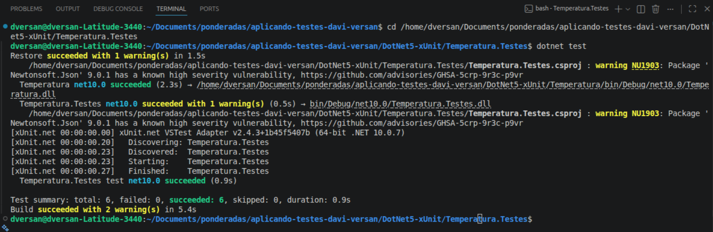

# Testes Unitários com xUnit

Esta seção detalha a implementação e execução de testes unitários para o projeto de conversão de temperaturas, utilizando a estrutura do framework **xUnit** em ambiente .NET.

## 1. Estrutura de Pastas e Arquivos

O projeto está organizado em uma arquitetura padrão de separação entre o código de produção (regras de negócio) e o código de testes. Com base na visualização do seu ambiente de desenvolvimento, a estrutura se divide da seguinte forma:

* **`APLICANDO-TESTES-DAVI-VERSAN/DotNet5-xUnit/`**: Diretório raiz do projeto.
  * **`Temperatura/`**: Projeto do tipo *Class Library* (Biblioteca de Classes) que contém a lógica de negócio da aplicação.
    * `ConversorTemperatura.cs`: Arquivo principal que contém os métodos responsáveis por realizar os cálculos matemáticos de conversão de temperaturas (por exemplo, de Fahrenheit para Celsius ou vice-versa).
    * `Temperatura.csproj`: Arquivo de configuração do projeto de produção.
    * `bin/` e `obj/`: Pastas geradas automaticamente pelo compilador do .NET contendo os binários e arquivos temporários de compilação.
  * **`Temperatura.Testes/`**: Projeto dedicado exclusivamente aos testes automatizados, referenciando o projeto `Temperatura`.
    * `TestesConversorTemperatura.cs`: Classe responsável por abrigar os cenários de testes unitários que validam os métodos da classe `ConversorTemperatura`.
    * `Temperatura.Testes.csproj`: Arquivo de configuração do projeto de testes, onde estão declaradas as dependências do framework de testes (como `xunit`, `xunit.runner.visualstudio` e `Microsoft.NET.Test.Sdk`).
    * `Temperatura.Testes.sln`: Arquivo de Solução do Visual Studio que agrupa os projetos.

---

## 2. Aplicação dos Testes (`TestesConversorTemperatura.cs`)

A classe de testes utiliza o framework **xUnit**, que é um dos padrões mais modernos e adotados no ecossistema .NET para testes de software. 

A aplicação dos testes segue os seguintes princípios técnicos:

* **Uso de Data-Driven Tests (`[Theory]` e `[InlineData]`):** Em vez de escrever um teste separado (usando o atributo `[Fact]`) para cada valor de temperatura a ser testado, o código faz uso do atributo `[Theory]`. O `[Theory]` indica que o teste recebe parâmetros.
  Os valores de entrada e o resultado esperado são passados através do atributo `[InlineData(valorEntrada, valorEsperado)]`. Isso permite testar múltiplos cenários (como temperaturas negativas, zero, e altas) executando o mesmo bloco de código de teste várias vezes com dados diferentes.

* **Padrão AAA (Arrange, Act, Assert):**
  A lógica interna do teste costuma seguir este padrão:
  1. **Arrange (Preparar):** Instanciação das classes necessárias (se não forem métodos estáticos) e preparação dos dados de entrada fornecidos pelo `InlineData`.
  2. **Act (Agir):** Invocação do método de conversão na classe `ConversorTemperatura` passando os valores de entrada.
  3. **Assert (Verificar):** Utilização da classe `Assert` do xUnit (ex: `Assert.Equal(valorEsperado, resultadoObtido)`) para garantir que o cálculo retornado pela classe de negócio é exatamente igual ao valor que se espera matematicamente. Se houver divergência de arredondamento, é comum utilizar o parâmetro de precisão (casas decimais) na asserção.

---

## 3. Resultados Obtidos

A execução dos testes foi realizada via terminal (CLI do .NET) através do comando `dotnet test` dentro do diretório `Temperatura.Testes`. Os resultados demonstram o comportamento da aplicação diante das asserções propostas:

* **Resumo da Execução (Test summary):**
  * **Total de Testes:** 6
  * **Passaram (Succeeded):** 6
  * **Falharam (Failed):** 0
  * **Ignorados (Skipped):** 0
  * **Duração:** 0.9 segundos

**Conclusão dos Testes:**
O resultado `succeeded: 6` indica que a classe `ConversorTemperatura` passou em todos os cenários estipulados no `[InlineData]`. A lógica matemática de conversão está correta e garantida contra regressões, com 100% de sucesso na suíte de testes.

